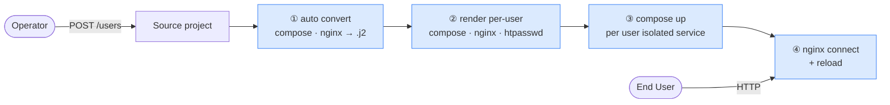
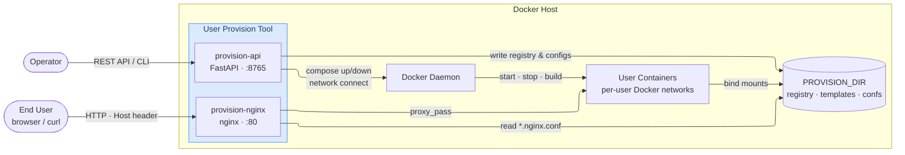

# User Provision Tool

Give each user their own isolated copy of a service — with one API call.
No template prep required: just point to your existing `docker-compose.yml` and nginx conf.

## What it does

Imagine a shared server that can instantly spin up a private workspace for any new user —
with its own containers, database, and dedicated web address — and tear it all down just as
quickly. No manual setup, no port conflicts, no data leaking between users.

Technically: you drop a plain `docker-compose.yml` (and optionally a plain nginx conf) into
a source project directory. When a user registers, the tool:

1. **Auto-converts** your plain files into per-user Jinja2 templates (once, on first use)
2. **Renders** isolated `docker-compose.user-{user}.{label}.yml` and `*.nginx.conf` for that user
3. **Starts** the containers with `docker compose up --project-name {isolated-name}`
4. **Routes** HTTP/HTTPS traffic by connecting `provision-nginx` to the user's Docker network and reloading nginx live
5. **Supports TLS** — pass `--https` with certificate paths and the tool copies certs, renders HTTPS server blocks, and enables SSL termination
6. **Tracks** state in `user_registry.yml` — remove a user's service and its containers are torn down cleanly

Per-user container names: `{service}-user_{user}-{label}-{svc}`
Per-user hostnames: `{service}-{user}-{label}.{domain}`



### What it is

A **provisioner**: given a Docker Compose stack, it stamps out one isolated, routed copy per user — on a single Docker host — via a single API call.

- **Your users are tenants**, not operators. They never touch Docker or the server.
- **Your service is a compose file** you already have. No rewrite into k8s manifests or job specs.
- **Your host is one machine.** You want simplicity, not a cluster.

### What it is not

- Not a multi-node scheduler — all containers run on the same host
- Not a general-purpose PaaS — it does one thing: provision and tear down per-user stacks

### How it compares

| Tool | Target user | Single-call tenant provisioning | Built-in routing | Multi-node | Complexity |
|---|---|---|---|---|---|
| **user_provision_tool** | Your end-customers / tenants | ✅ | ✅ nginx — per-user-service conf, hot-reloaded | ❌ single host | low |
| **Coolify** | Developers / operators | ❌ operator-scoped | ✅ Traefik or Caddy via Docker labels | ❌ single host | low |
| **Docker Swarm** | Operators | ❌ you script it | ❌ none built-in | ✅ | medium |
| **Nomad** | Operators | ❌ you script it | ❌ needs Consul Connect | ✅ | medium |
| **Kubernetes** | Operators | ❌ you script it | ✅ ingress controllers | ✅ | high |

---

## Quick Start (API)

**1. Set up the provision directory and drop in your service**
```bash
export PROVISION_DIR=/srv/provision
mkdir -p $PROVISION_DIR/{generated,ssl,source_projects/myapp}
# copy your service into source_projects/myapp/  (Dockerfile, docker-compose.yml, nginx.conf, .env, ...)
```

**2. Start the provision service**
```bash
docker compose -f docker-compose.provision.yml up -d --build
```

**3. Register a user — just the service name and filenames**

*Async (default) — returns task_id immediately, work runs in background:*
```bash
curl -X POST http://localhost:8765/users \
  -H 'Content-Type: application/json' \
  -d '{
    "user_name": "alice",
    "service_name": "myapp",
    "project_root": "myapp",
    "compose_file_path": "docker-compose.yml",
    "nginx_conf_file_path": "nginx.conf",
    "env_file_path": ".env",
    "domain": "example.com",
    "passwd": "secret"
  }'
# → {"task_id": "a1b2c3d4e5f6", "status": "pending", "type": "register"}
```

*Sync (blocking) — add ?sync=true:*
```bash
curl -X POST "http://localhost:8765/users?sync=true" \
  -H 'Content-Type: application/json' \
  -d '{...}'
# → {"status": "registered", "entry": {...}, "copied_env": ".../.env.alice.0"}
```

**4. Poll task status or check all tasks**
```bash
curl http://localhost:8765/tasks/a1b2c3d4e5f6
# → {"task_id": "a1b2c3d4e5f6", "status": "completed", "result": {...}}

curl http://localhost:8765/tasks
# → {"count": 3, "tasks": [...]}

curl -X DELETE http://localhost:8765/tasks/a1b2c3d4e5f6
# → cancel a pending/running task
```

**5. Check user status**
```bash
curl http://localhost:8765/users/alice
```

**6. Rebuild (with proxy build args)**
```bash
curl -X POST "http://localhost:8765/users/alice/services/myapp/0/rebuild?sync=true" \
  -H 'Content-Type: application/json' \
  -d '{"no_cache": true, "build_args": {"HTTP_PROXY": "http://proxy:8080"}}'
```

**7. Remove**
```bash
curl -X DELETE "http://localhost:8765/users/alice/services/myapp/0?sync=true"
```

**8. Register with HTTPS**
```bash
# Full path — certs are copied to $PROVISION_DIR/ssl/example.com/
curl -X POST "http://localhost:8765/users?sync=true" \
  -H 'Content-Type: application/json' \
  -d '{
    "user_name": "alice",
    "service_name": "myapp",
    "project_root": "myapp",
    "compose_file_path": "docker-compose.yml",
    "nginx_conf_file_path": "nginx.conf",
    "domain": "example.com",
    "https": true,
    "fullchain": "/etc/letsencrypt/live/example.com/fullchain.pem",
    "privkey": "/etc/letsencrypt/live/example.com/privkey.pem"
  }'

# Bare filename — certs already in $PROVISION_DIR/ssl/example.com/
curl -X POST "http://localhost:8765/users?sync=true" \
  -H 'Content-Type: application/json' \
  -d '{
    "user_name": "alice",
    "service_name": "myapp",
    "project_root": "myapp",
    "compose_file_path": "docker-compose.yml",
    "nginx_conf_file_path": "nginx.conf",
    "domain": "example.com",
    "https": true,
    "fullchain": "fullchain.pem",
    "privkey": "privkey.pem"
  }'
```

---

## Quick Start (CLI)

```bash
# Register — just the service name as project root + filenames
python cli/register.py \
  -u alice -sn myapp \
  -pr myapp \
  -fc docker-compose.yml \
  -fn nginx.conf \
  -e .env \
  -d example.com

# Or use a full path when the project isn't under SOURCE_PROJECTS_DIR
python cli/register.py \
  -u alice -sn myapp \
  -pr /srv/provision/source_projects/myapp \
  -fc docker-compose.yml \
  -fn nginx.conf \
  -d example.com

# Status
python cli/status.py -u alice

# Rebuild
python cli/rebuild.py -u alice -sn myapp -l 0

# Remove
python cli/remove.py -u alice -sn myapp -l 0

# With HTTPS
python cli/register.py \
  -u alice -sn myapp \
  -pr myapp \
  -fc docker-compose.yml \
  -fn nginx.conf \
  -d example.com \
  --https \
  --fullchain /etc/letsencrypt/live/example.com/fullchain.pem \
  --privkey /etc/letsencrypt/live/example.com/privkey.pem
```

---

## Architecture



---

## Documentation

| Document | Topic |
|---|---|
| [architecture.md](docs/architecture.md) | Module layout, data flows, naming conventions |
| [api-reference.md](docs/api-reference.md) | All REST endpoints and request/response schemas |
| [cli-reference.md](docs/cli-reference.md) | CLI script arguments and examples |
| [templates.md](docs/templates.md) | Writing compose and nginx templates |
| [deployment.md](docs/deployment.md) | Running in production, environment variables |
| [testing.md](docs/testing.md) | Running unit, e2e, and integration tests |
| [template_rendering_workflow.md](docs/template_rendering_workflow.md) | Step-by-step rendering pipeline |
| [SKILL.md](skills/provision-api/SKILL.md) | VS Code AI skill — curl reference, compose & nginx templates for new services |

---

## Development

```bash
# Install dependencies (requires uv)
uv sync

# Run unit + e2e + proxy + task manager tests (181 tests, no Docker needed)
uv run pytest tests/test_unit.py tests/test_e2e.py tests/test_proxy_support.py tests/test_task_manager.py -v

# Run full integration tests (requires Docker)
sudo bash tests/test_integration.sh
```
