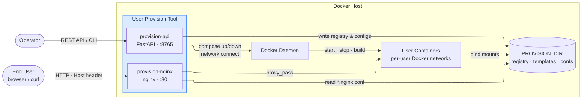

# Architecture: User Containers Provision Tool

## High-Level Diagram




## Directory Layout

```
user_provision_tool/
├── api.py                         # FastAPI REST service (primary runtime entry point)
├── docker-compose.provision.yml   # Runs the provision-api container itself
├── Dockerfile                     # Builds the provision-api image
├── pyproject.toml / uv.lock       # Python dependencies (managed via uv)
│
├── cli/                           # CLI entry points (direct/scripted use)
│   ├── __init__.py
│   ├── register.py                # Register user + start containers
│   ├── remove.py                  # Stop + deregister a user's service
│   ├── rebuild.py                 # Rebuild user containers
│   ├── status.py                  # Query container health
│   ├── gen_compose_template.py    # Convert plain compose file → .j2 template
│   └── gen_nginx_template.py      # Convert plain nginx conf  → .j2 template
│
├── lib/                           # Shared library modules
│   ├── __init__.py
│   ├── validation.py              # Name/label regex validation
│   ├── registry.py                # CRUD on user_registry.yml
│   ├── template_engine.py         # Jinja2 compose + nginx rendering
│   ├── auth.py                    # Password hashing (passlib/bcrypt)
│   ├── docker_ops.py              # Subprocess wrappers for docker compose
│   ├── provisioner.py             # Shared registration / removal / rebuild workflow
│   ├── compose_converter.py       # Plain docker-compose.yml → Jinja2 template
│   ├── nginx_converter.py         # Plain nginx conf → Jinja2 template
│   └── task_manager.py            # Async task pool (ThreadPoolExecutor) for background Docker ops
│
├── source_projects/               # SOURCE_PROJECTS_DIR = $PROVISION_DIR/source_projects
│   │                              # Bare project_root name "myapp" → source_projects/myapp/
│   └── {project}/
│       ├── Dockerfile
│       ├── docker-compose.{project}.yml.j2        # compose template
│       └── docker-compose.user-{user}.{label}.yml # rendered per-user compose
│
├── generated/                     # GENERATED_DIR = $PROVISION_DIR/generated (auto-created)
│   ├── user_registry.yml          # Managed state file
│   ├── {svc}.user-{user}-{label}.nginx.conf
│   └── {svc}.user-{user}-{label}.htpasswd
│
└── tests/
    ├── conftest.py                # Shared pytest fixtures
│   ├── test_unit.py               # Unit tests
│   ├── test_e2e.py                # End-to-end pytest tests
│   ├── test_proxy_support.py      # Proxy / --build-arg tests
│   ├── test_task_manager.py       # Async task pool tests
│   ├── test_integration.sh        # Full Docker integration test
│   ├── mock_proxy.py              # Forward HTTP/HTTPS proxy for integration tests
    └── fixtures/
        ├── docker-compose.template.yml.j2
        ├── myapp.template.nginx.conf.j2
        ├── docker-compose.plain.yml
        └── myapp.plain.nginx.conf
```

---

## Module Responsibilities

| Module | Responsibility |
|---|---|
| `validation.py` | Enforce `[a-zA-Z0-9_]` for names, `[0-9]` for label; raise `ValidationError` |
| `registry.py` | Load/save `user_registry.yml`; add/remove/query entries by user+service+label |
| `template_engine.py` | Extract template volumes; render compose and nginx files via Jinja2; copy `.env` alongside output |
| `auth.py` | `getpass` prompt; bcrypt hash via `passlib.hash.bcrypt`; write `.htpasswd` file |
| `docker_ops.py` | `compose_up`, `compose_down`, `compose_build`, `docker_ps`, `network_connect`, `network_disconnect`, `nginx_reload` wrappers; real-time stdout/stderr via `subprocess.Popen` + threading; supports `--build-arg` for proxy; writes to `DOCKER_OPS_LOG` file when env var is set |
| `provisioner.py` | Shared workflow for register/remove/rebuild; supports `build_args` (proxy) passed through to docker_ops; both `api.py` and `cli/` delegate here |
| `compose_converter.py` | Parse a plain `docker-compose.yml` and emit a Jinja2 `.yml.j2` template; services with named profiles are excluded; `profiles:` key is stripped from kept services |
| `nginx_converter.py` | Apply regex substitutions to a plain nginx conf and emit a `.j2` template; injects `auth_basic` + `auth_basic_user_file` directives before the first `proxy_pass` if none are already present; detects when a `proxy_pass` host matches a compose service name and rewrites it to `{{ container_prefix }}<name>` |
| `task_manager.py` | In-memory async task pool (`ThreadPoolExecutor`); submit → status → cancel lifecycle; powers `GET /tasks`, `GET /tasks/{id}`, `DELETE /tasks/{id}` endpoints |

---

## Module Dependencies

```
  api.py                →  task_manager → provisioner → validation, registry, template_engine, auth, docker_ops
  cli/register.py       →  provisioner  →  (same)
  cli/remove.py         →  provisioner  →  registry, docker_ops
  cli/rebuild.py        →  provisioner  →  registry, docker_ops
  cli/status.py         →               →  registry, docker_ops, template_engine
  cli/gen_compose_template.py  →  compose_converter
  cli/gen_nginx_template.py    →  nginx_converter
```

---

## Data Flows

### Registration (API or CLI)

```
Input: user_name, service_name, label, volumes, passwd, template paths, env_file?
  │
  ├─ validation.py ── validate names and label format
  │
  ├─ template_engine.py ── extract declared volume keys from template
  │       └─ volumes mismatch? → CLI warns + prompts; API rejects with 400
  │
  ├─ provisioner.register_user()  ← single entry point for both CLI and API
  │       │
  │       ├─ auth.py ── hash password → bcrypt hash
  │       │
  │       ├─ registry.py ── append entry to user_registry.yml
  │       │
  │       ├─ template_engine.py ── render docker-compose.user-{user}.{label}.yml
  │       │       └─ written into project root (source dir, next to Dockerfile)
  │       │       └─ env_file provided? → copy .env next to compose file
  │       │
  │       ├─ template_engine.py ── render {svc}.user-{user}.{label}.nginx.conf  (optional)
  │       │       └─ written into GENERATED_DIR
  │       │       └─ auth.py ── write .htpasswd into GENERATED_DIR
  │       │
  │       ├─ docker_ops.py ── docker compose -f <compose> --project-name <network_name> [--env-file <env>] up -d
  │       │
  │       └─ docker_ops.py ── network_connect + nginx_reload
  │
  └─ optional pre-step: compose_converter / nginx_converter
          └─ triggered by -fc / -fn flags; converts plain files → .j2 before registration
```

### Removal

```
Input: user_name, service_name, label
  │
  ├─ registry.py ── look up compose_file_path + env_file_path
  │
  ├─ docker_ops.py ── docker compose --project-name <network_name> down
  │
  └─ registry.py ── remove entry from user_registry.yml
```

### Rebuild

```
Input: user_name, service_name, label
  │
  ├─ registry.py ── look up compose_file_path + env_file_path
  │
  ├─ docker_ops.py ── docker compose --project-name <network_name> build
  │
  └─ docker_ops.py ── docker compose --project-name <network_name> up -d
```

---

## Naming Conventions

| Artifact | Pattern |
|---|---|
| Compose file | `docker-compose.user-{user_name}.{label}.yml` |
| Nginx conf | `{service_name}.user-{user_name}.{label}.nginx.conf` |
| htpasswd file | `{service_name}.user-{user_name}.{label}.htpasswd` |
| Copied env file | `{env_file_basename}` (placed next to compose file) |
| Container prefix | `{service_name}-user_{user_name}-{label}-` |
| Nginx hostname | `{service_name}-{user_name}-{label}.{domain_name}` |

---

## Key Design Decisions

1. **`cli/` package** — all four CLI scripts live under `cli/` and share `lib/` with no logic duplication. The `api.py` is the preferred runtime entry point.
2. **`.j2` template extension** — compose and nginx templates use the `.j2` suffix so YAML linters do not flag Jinja2 placeholders as syntax errors.
3. **Two placeholder types in templates** — `{{ var }}` is resolved by Jinja2 at render time; `${ENV_VAR}` is passed through as literal text and resolved by `docker compose` at runtime via `--env-file`.
4. **Docker socket pattern** — the provision-api container mounts `/var/run/docker.sock` and runs `docker compose` without `sudo`. No Docker daemon is installed inside the container; only the CLI binary is present.
5. **Same-path bind mount** — `${PROVISION_DIR}:${PROVISION_DIR}` ensures the absolute paths written into generated compose files are valid on the host where the Docker daemon runs. It also means a bare `project_root` name like `"myapp"` resolves to `SOURCE_PROJECTS_DIR/myapp` (`$PROVISION_DIR/source_projects/myapp` by default) — the same absolute path both inside the container and on the host.
6. **`passlib.hash.bcrypt`** — passwords are hashed with `bcrypt.using(rounds=12).hash()`; hashes are stored in `user_registry.yml` and written into `.htpasswd` files for nginx basic auth.
7. **`user_registry.yml` as source of truth** — `cli/status.py` and `GET /users` cross-reference live `docker ps` output against registry entries to compute per-service health.
8. **Docker Compose project isolation** — every `compose_up`, `compose_down`, and `compose_build` call passes `--project-name {network_name}`. Because all rendered compose files share the same source directory, omitting this would cause Compose to infer the same project name for all users and tear down one user's containers when starting another's.
9. **BuildKit enabled in subprocesses** — all `docker` subprocess calls inherit `DOCKER_BUILDKIT=1` from `os.environ`. This is required for Docker 29+ (where BuildKit is the default builder) and enables `--mount=type=cache` and other BuildKit Dockerfile features.
10. **`provision-nginx` as shared ingress** — user containers never bind host ports (`ports:` is stripped from compose templates). All HTTP traffic enters through the `provision-nginx` sibling container, which routes by virtual host (`Host:` header → `server_name`). After every registration or removal, provision-api connects/disconnects nginx to the user's isolated Docker network and calls `nginx -s reload` to update routing without a container restart.

---

## Status Model

```
Registry entries for user
        │
        ▼
For each entry → expected containers = services declared in compose template
        │
        ├─ docker ps match, status "Up"           → healthy_containers
        ├─ docker ps match, status contains error  → unhealthy_containers
        └─ not found in docker ps output           → missing_containers

Service health = "healthy"  iff  healthy == expected  AND  unhealthy + missing == 0
```

### Status Response Schema

```json
{
  "user_status": [
    {
      "user_name": "alice",
      "summary": {
        "expected_services_#": 2,
        "healthy_services_#": 1,
        "unhealthy_services_#": 0
      },
      "healthy_services": [
        {
          "service_name": "myapp",
          "label": "0",
          "compose_file_path": "/srv/provision/generated/docker-compose.myapp-user_alice-0.yml",
          "healthy_containers": { "myapp-user_alice-0-web": "Up 2 hours" },
          "unhealthy_containers": {},
          "missing_containers": {}
        }
      ],
      "unhealthy_services": [],
      "missing_services": []
    }
  ]
}
```
